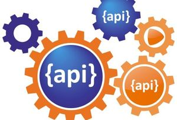

:stylesheet: zalando.css
:source-highlighter: coderay
:toc: macro
:toclevels: 2
:leveloffset: +1
:sectlinks:
:sectnumlevels: 1

:creator: Zalando SE
:producer: Asciidoctor
:keywords: Zalando, Guidelines, RESTful, API, Events, Schema
:copyright: CC-BY-SA 4.0

:MUST: pass:[<strong>Must:</strong>]
:SHOULD: pass:[<strong>Should:</strong>]
:MAY: pass:[<strong>May:</strong>]
:MUST-SHOULD: pass:[<strong>Must</strong>/<strong>Should</strong>:]

= Zalando RESTful API と イベントスキーマのガイドライン
Zalando SE (翻訳: https://github.com/kawasima[kawasima])
Original: https://opensource.zalando.com/restful-api-guidelines/

別の形式: link:zalando-guidelines-ja.pdf[PDF], link:zalando-guidelines-ja.epub[EPUB3]

License: CC-BY-SA 4.0 © Zalando SE 2018 & CC-BY-SA 4.0 © kawasima 2018

toc::[]

:sectnums:

include::chapters_ja/introduction.ja.adoc[]
include::chapters_ja/design-principles.ja.adoc[]
include::chapters_ja/general-guidelines.ja.adoc[]
include::chapters_ja/meta-information.ja.adoc[]
include::chapters_ja/security.ja.adoc[]
include::chapters_ja/compatibility.ja.adoc[]
include::chapters_ja/deprecation.ja.adoc[]
include::chapters_ja/json-guidelines.ja.adoc[]
include::chapters_ja/naming.ja.adoc[]
include::chapters_ja/resources.ja.adoc[]
include::chapters_ja/http-requests.ja.adoc[]
include::chapters_ja/http-status-codes-and-errors.ja.adoc[]
include::chapters_ja/performance.ja.adoc[]
include::chapters_ja/pagination.ja.adoc[]
include::chapters_ja/hyper-media.ja.adoc[]
include::chapters_ja/data-formats.ja.adoc[]
include::chapters_ja/common-data-types.ja.adoc[]
include::chapters_ja/common-headers.ja.adoc[]
include::chapters_ja/proprietary-headers.ja.adoc[]
include::chapters_ja/api-operation.ja.adoc[]
include::chapters_ja/events.ja.adoc[]
include::chapters_ja/references.ja.adoc[]
include::chapters_ja/tooling.ja.adoc[]
include::chapters_ja/best-practices.ja.adoc[]
include::chapters_ja/changelog.ja.adoc[]

++++
<!-- Adds rule id as a postfix to all rule titles -->

<!-- Add table of contents anchor and remove document title -->

<!-- Adds sidebar navigation -->

++++

++++